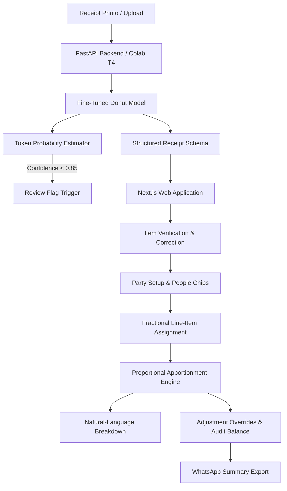

# Track 1: SplitSnap
Itemised Bill-Splitting from a Single Photo
>> OCR-Free Receipt Parsing with Fine-Tuned Donut & Mathematically Fair Proportional Bill Splitting

This is a web app designed to solve group dining bill splitting. Instead of splitting taxes, service charges, and discounts equally across everyone at the table (to reduce unfair splitting), our pipeline calculates each person's exact consumption subtotal and proportions all shared taxes and fees accordingly.

Receipt extraction is powered by an end-to-end visual document understanding model (Donut / `naver-clova-ix/donut-base`) fine-tuned for restaurant receipts, avoiding the error cascading common in multi-stage OCR pipelines.

--

## Key Features:

- **OCR-Free Visual Extraction**: Line items, quantities, prices, taxes, service charges and discounts extraction from raw camera captures in a single pass using a visual transformer (Swin-B encoder + mBART decoder).
- **Uncertainty Highlighting:** Uses token-level decoder softmax probabilities to highlight items with low confidence ($< 0.85$) for quick user verification before splitting.
- **Line-Item Check:** Before you proceed, diners can correct misread numbers, update quantities or add manual items using an editable review table.
- **Fractional Item Sharing:** Share appetizer, pizza or platter amongst any subset of diners ($1/2$, $1/3$, $1/N$) with individual subtotals updated in real-time.
- **Proportional Apportionment:** Taxes (CGST, SGST, VAT) and restaurant service charges are divided according to each diner’s share of the table subtotal, not an arbitrary even split.
- **Manual Adjustments & Audit Balance:** Custom amount overrides (e.g. cash payments or rounded contributions) with real-time variance tracking against the original bill total.
- **One Click WhatsApp Summary:** Generates nice formatted text summaries that can be copied and sent to the group chat.

--

## Architecture


--

## Project Structure
```
nalafaad/
|
|-- backend/
|   |-- app/
|   |   |-- main.py
|   |   |-- apportionment.py
|   |   |-- explanation.py
|   |   |-- inference.py
|   |   |-- schemas.py
|   |   `-- sample_bills.py
|   |
|   |-- tests/
|   |   `-- test_apportionment.py
|   |
|   |-- requirements.txt
|   `-- run.py
|
|-- frontend/
|   |-- src/
|   |   |-- app/
|   |   |   |-- page.tsx
|   |   |   |-- layout.tsx
|   |   |   `-- globals.css
|   |   |
|   |   |-- components/
|   |   |   |-- Header.tsx
|   |   |   |-- StepCapture.tsx
|   |   |   |-- StepCorrection.tsx
|   |   |   |-- StepParty.tsx
|   |   |   |-- StepAssignment.tsx
|   |   |   |-- StepSummary.tsx
|   |   |   `-- ManualOverrideModal.tsx
|   |   |
|   |   `-- lib/
|   |       |-- apportionmentClient.ts
|   |       |-- sampleData.ts
|   |       `-- types.ts
|   |
|   `-- package.json
|
|-- ml/
|   |-- scripts/
|   |   |-- prepare_cord_indianized.py
|   |   `-- augment_receipts.py
|   |
|   |-- notebooks/
|   |   `-- SplitSnap_Donut_Colab_FineTuning.ipynb
|   |
|   `-- train_donut.py
|
|-- MODEL_REPORT.md
`-- README.md
```
--

## Step by Step Execution Guide

1. Prerequisites
- Python: 3.10 or higher
- Node.js: 18.0 or higher (with npm)
- Git
- Optional- Google collab for training the model or locally train it. Or since we have already trained use the locally saved model.
--
2. Environment Setup

Clone the repository and install the backend Python dependencies:
```bash
# Clone the project
git clone https://github.com/x2Allen2775/Nalafaad-ML-track-pipeline.git
cd Nalafaad-ML-track-pipeline

# Create and activate a virtual environment
python3 -m venv venv
source venv/bin/activate    # On Windows: venv\Scripts\activate

# Install backend dependencies
pip install -r backend/requirements.txt
```
--
3. ML Pipeline: Datadet Prepration And Augmnetation

The repository includes scripts to adapt public receipt datasets (CORD) into realistic Indian restaurant bills with statutory tax structures:
--
```bash
# Step 3a: Process CORD parquet splits and inject Indian dishes, merchants, and CGST/SGST taxes
python3 ml/scripts/prepare_cord_indianized.py

# Step 3b: (Optional) Apply realistic physical degradations (paper fold shadows, tilts, and blur)
python3 ml/scripts/augment_receipts.py
```
This produces processed training files in `ml/data/processed/` conforming to the Target Extraction Schema.
--
4. Model Training: Fine-Tuning Donut

You can train or fine-tune the visual document model through either Google Colab (recommended) or locally via PyTorch:

For Google Collab-
    1. Upload `ml/notebooks/SplitSnap_Donut_Colab_FineTuning.ipynb` to Google Colab and open it.

    2. Go to:
    **Runtime → Change runtime type → T4 GPU → Save**

    3. Run **Sections 1 to 5**.
    This will download the base `naver-clova-ix/donut-base` model and fine-tune it using Indian dining receipt data.

    4. Run **Section 6**.
    This starts the Uvicorn server in the background and creates the Ngrok tunnel.

    5. At the end of Section 6, copy the public URL that is printed in the output.
    Example:
    `https://xxxx-xx-xx.ngrok-free.dev`

    6. Use this URL in the frontend/backend configuration wherever the API endpoint is required.

For local Training-
If you have a local NVIDIA GPU:
```bash
python3 ml/train_donut.py \
  --data_file ml/data/processed/indianized_dataset.jsonl \
  --images_dir ml/data/processed/images \
  --output_dir ml/models/donut_splitsnap \
  --epochs 5 \
  --batch_size 1 \
  --grad_accum_steps 8
```
--
## 5. Runnning the App:
Terminal 1 - Start the FastAPI Backend

# From the repository root
python3 backend/run.py

The backend should start at:
http://localhost:8000

To check if it is running:
curl http://localhost:8000/api/health

You should get something like:
{"status":"healthy","service":"SplitSnap Backend",...}


Terminal 2 - Start the Next.js Frontend

# Go to the frontend folder
cd frontend

# Install dependencies
npm install

# Use the local backend
echo "NEXT_PUBLIC_API_URL=http://localhost:8000" > .env.local

# OR, if you are using the Colab T4 GPU tunnel:
echo "NEXT_PUBLIC_API_URL=https://your-ngrok-url.ngrok-free.dev" > .env.local

# Start the frontend
npm run dev

Then open this in your browser:
http://localhost:3000
--
## 6. Verification Demo:
Once the app is running at http://localhost:3000, follow these 5 steps to test everything:

1. Step 1 - Bill Input & Extraction

   - 1-Click Test Drive:
     Click any sample bill:
     Punjab Grill & Bar, Bawarchi Biryani, or Saravanaa Bhavan.

   - OR Custom Upload:
     Click Choose File to upload a receipt image.
     You can also click Take Photo to test the mobile camera.


2. Step 2 - Line-Item Verification & Uncertainty Detection

   - Low-confidence rows will have an amber dashed highlight.
     These are fields where the token decoder confidence is < 0.85.

   - Test inline editing:
     Click on any price, quantity, or item name and change it.

   - Click Confirm or Add Item to add a new line item.
     The totals will update automatically.

   - Click Continue to People.


3. Step 3 - Diner Management

   - Enter the names of the people in the party.
     You can also use the quick presets:
     Rahul, Priya, Amit.

   - Click Continue to Assign.


4. Step 4 - Interactive Item Sharing

   - Click any item card to expand it and select who shared the item.

   - You can choose fractional shares:
     1/1, 1/2, 1/3, or all.

   - The per-person subtotal bars at the bottom will update
     automatically as items are assigned.

   - Click See Final Split.


5. Step 5 - Proportional Apportionment & Breakdown

   - Check the final amount for each person.
     CGST, SGST, and service charges are divided according
     to each person's share of the subtotal instead of being
     split equally.

   - Click How this was calculated under any person's card
     to see the plain-language mathematical explanation.

   - Click the pencil icon next to a person's amount to test
     a manual adjustment, such as paying in cash.
     The balance meter will show the difference from the
     original bill total.

   - Click Copy for WhatsApp to copy the formatted summary
     and send it to the group chat.
--

## 7. Running Automated Unit Tests

To verify mathematical fairness, consumption ratios, manual adjustment handling, and explanation structure:
```bash
PYTHONPATH=. python3 backend/tests/test_apportionment.py
```
Expected output:
```
All apportionment tests passed!
```
--
## Apportionment Mathematics

### 1. Individual Subtotal

For diner i sharing in items k ∈ Items(i), where item k has price c_k
and is shared by |S_k| people:

S_i = Σ(k ∈ Items(i)) c_k / |S_k|


### 2. Table Consumption Ratio

P_i = S_i / Σ(j=1 to N) S_j


### 3. Proportional Taxes and Surcharges

Taxes (T), service charges (C), and discounts (D) are distributed
strictly based on P_i:

T_i = P_i × T_total
C_i = P_i × C_total
D_i = P_i × D_total


### 4. Final Amount & Rounding Reconciliation

Final_i = S_i + T_i + C_i - D_i

Any fractional penny or paisa rounding discrepancy
(Δ = Total_bill - Σ Final_i) is attributed to the highest-share
diner to ensure exact mathematical balance with the original receipt total.
